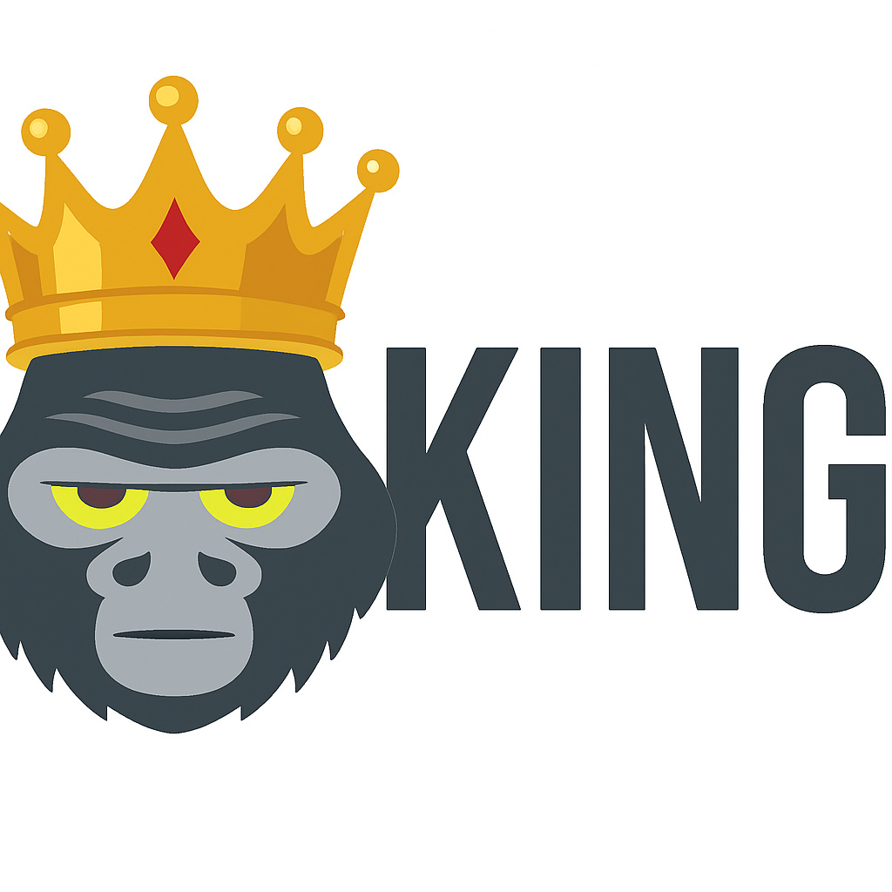

<p align="center"></p>

# Completion and manual generator for kong

> Create manual pages and completions for Go kong CLI programs

[kong](https://github.com/alecthomas/kong) is a very nice command-line parser for Go. But it misses the
ability to generate (good) shell completions. There are some integrations but they require source level
changes. With _king_ you can just generate the completion files separately from a `kong.Node`.

This package copies from [gum](https://github.com/charmbracelet/gum) and made into a standalone library +
some extra features, like telling (via struct tags) how certain things must be completed. The Bash
completions are completely reworked and for both Zsh and Bash have positional argument completion. For the
Fish shell the origin _gum_ completion was used and not made better.

King can _also_ generate manual pages from a Kong node, see godoc for more information.

Any struct field can have an extra tag:

- `completion:""` which contains a shell command that should be used for completion _or_ a string between
  `<` and `>` which should be a Bash action as specified in the `complete` function in bash(1), like `<file>`
  or `<directory>`. These are translated to things Zsh understands.

I use [Zsh](https://zsh.org), so this is where my initial focus is. The
[Bash](https://www.gnu.org/software/bash/) completion works, but can probably be done a lot better.

And for manual creation:

- `description:""` text used in the description section of the manual page.
- `deprecated:""` this flag is deprecated.

Extra flags can be injected:

```go
fl := &kong.Flag{
   Value: &kong.Value{
       Name: "man",
       Help: "Show context-sensitive manual page.",
       Tag:  &kong.Tag{},
   },
}
```

And then assign it the to `Flags` in Zsh, Bash or Man.

Note that for completion you give it a *kong.Node and the completion rolls out, for manual creation you give
it the *root* `*kong.Node`and a path through the`cmd` field names.
This is needed because we need a fully parsed Node tree as made by Kong to have access to all tags.

Run the tests to see example files being created.

## Supported "actions"

The following actions are supported:

- "file", "directory"
- "group"
- "user"
- "export"

And are converted to the correct construct in the completion that is generated for the specific shell.

## Status

- Bash: everything supported, actions, positional commands and flags.
- Zsh: everything supported, action, positional commands and flags.
- Fish: everything 'gum' supports, no actions, and probably no positional commands. Generally unfinished.
